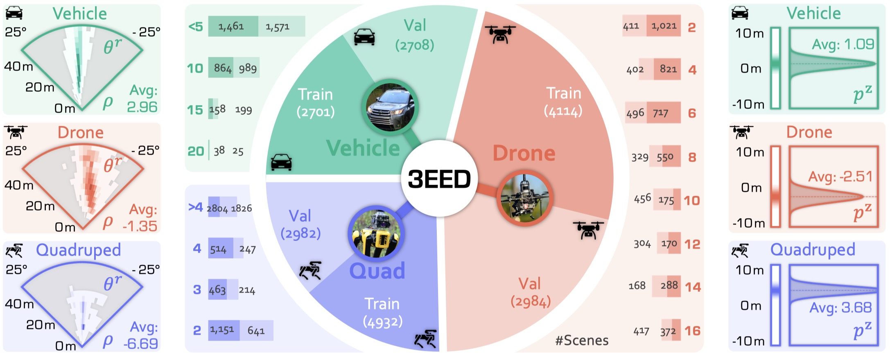

<h1 align="center">3EED: Ground Everything Everywhere in 3D</h1>

<p align="center">
    <a href="https://huggingface.co/datasets/RRRong/3EED/"></a>
    <a href="https://arxiv.org/"></a>
  <a href="https://3eed.github.io"></a>
  <a href="LICENSE"></a>
  
  
  
</p>

<p align="center" style="line-height: 1.3;">
  <strong><a href="https://rongli.tech/">Rong Li</a></strong><sup>1,*</sup>,
  <strong><a href="https://scholar.google.com/citations?hl=zh-CN&user=kMui170AAAAJ">Yuhao Dong</a></strong><sup>2,*</sup>,
  <strong><a href="https://scholar.google.com/citations?hl=en&user=RJ7NR54AAAAJ">Tianshuai Hu</a></strong><sup>3,*</sup>,
  <strong><a href="https://alanliangc.github.io/">Ao Liang</a></strong><sup>4,*</sup>,
  <strong><a href="https://scholar.google.com/citations?user=J9a48hMAAAAJ&hl=en">Youquan Liu</a></strong><sup>5,*</sup>,
  <strong><a href="https://dylanorange.github.io/">Dongyue Lu</a></strong><sup>4,*</sup><br>
  <strong><a href="https://scholar.google.com/citations?user=lSDISOcAAAAJ">Liang Pan</a></strong><sup>6</sup>,
  <strong><a href="https://ldkong.com/">Lingdong Kong</a></strong><sup>4†</sup>,
  <strong><a href="https://junweiliang.me/">Junwei Liang</a></strong><sup>1,3‡</sup>,
  <strong><a href="https://liuziwei7.github.io/">Ziwei Liu</a></strong><sup>2‡</sup><br>
</p>
<p align="center" style="line-height: 0.9;">
  <sup>1</sup>HKUST(GZ) · 
  <sup>2</sup>NTU · 
  <sup>3</sup>HKUST · 
  <sup>4</sup>NUS · 
  <sup>5</sup>FDU · 
  <sup>6</sup>Shanghai AI Lab<br>
  <br>
  <sup>*</sup>Equal contribution &nbsp;
  <sup>†</sup>Project lead &nbsp; 
  <sup>‡</sup>Corresponding authors
</p>

---

<p align="center">
  
</p>


## 🎯 Highlights

- **🌍 Cross-Platform**: First 3D grounding dataset spanning **vehicle**, **drone**, and **quadruped** platforms
- **📊 Large-Scale**: Large-scale annotated samples across diverse real-world scenarios
- **🔀 Multi-Modal**: Synchronized **RGB**, **LiDAR**, and **language** annotations
- **🎯 Challenging**: Complex outdoor environments with varying object densities and viewpoints
- **📏 Reproducible**: Unified evaluation protocols and baseline implementations


## Statistics

<p align="center">
  
</p>

> 📄 For detailed dataset statistics and analysis, please refer to our paper.


## 📰 News

- **[2025.10]** 📦 Dataset and code are now publicly available on HuggingFace and GitHub!
- **[2025.09]** 🎉 3EED has been accepted to **NeurIPS 2025 Dataset and Benchmark Track**!

## 📚 Table of Contents

- [🎯 Highlights](#-highlights)
- [Statistics](#statistics)
- [📰 News](#-news)
- [📚 Table of Contents](#-table-of-contents)
- [⚙️ Installation](#️-installation)
  - [Environment Setup](#environment-setup)
  - [Custom CUDA Operators](#custom-cuda-operators)
- [📦 Pretrained Models](#-pretrained-models)
  - [Language Encoder](#language-encoder)
- [💾 Dataset](#-dataset)
  - [Download](#download)
  - [Dataset Structure](#dataset-structure)
- [🚀 Quick Start](#-quick-start)
  - [Training](#training)
  - [Evaluation](#evaluation)
  - [Visualization](#visualization)
  - [Baseline Checkpoints](#baseline-checkpoints)
- [📖 Citation](#-citation)
- [📄 License](#-license)
- [🙏 Acknowledgements](#-acknowledgements)
  - [Codebase \& Methods](#codebase--methods)
  - [Dataset Sources](#dataset-sources)


## ⚙️ Installation

### Environment Setup

We support both CUDA 11 and CUDA 12 environments. Choose the one that matches your system:

<details>
<summary><b>Option 1: CUDA 11.1 Environment</b></summary>

| Component   | Version         |
|-------------|-----------------|
| CUDA        | 11.1            |
| cuDNN       | 8.0.5           |
| PyTorch     | 1.9.1+cu111     |
| torchvision | 0.10.1+cu111    |
| Python      | 3.10 / 3.11     |

**Setup:**
```bash
conda env create -f environment_cu11.yaml
conda activate 3eed
```
</details>

<details>
<summary><b>Option 2: CUDA 12.4 Environment</b></summary>

| Component   | Version         |
|-------------|-----------------|
| CUDA        | 12.4            |
| cuDNN       | 8.0.5           |
| PyTorch     | 2.5.1+cu124     |
| torchvision | 0.20.1+cu124    |
| Python      | 3.10 / 3.11     |

**Setup:**
```bash
conda env create -f environment_cu12.yaml
conda activate 3eed
```
</details>

### Custom CUDA Operators

```bash
cd ops/teed_pointnet/pointnet2_batch
python setup.py develop

cd ../roiaware_pool3d
python setup.py develop
```

## 📦 Pretrained Models

### Language Encoder

Download the [RoBERTa-base checkpoint](https://huggingface.co/FacebookAI/roberta-base/) from HuggingFace and move it to `data/roberta_base`.

## 💾 Dataset

### Download

Download the 3EED dataset from HuggingFace:

🔗 **Dataset Link**: https://huggingface.co/datasets/RRRong/3EED

### Dataset Structure

After extraction, organize your dataset as follows:

```
data/3eed/
├── drone/                    # Drone platform data
│   ├── scene-0001/
│   │   ├── 0000_0/
│   │   │   ├── image.jpg
│   │   │   ├── lidar.bin
│   │   │   └── meta_info.json
│   │   └── ...
│   └── ...
├── quad/                     # Quadruped platform data
│   ├── scene-0001/
│   └── ...
├── waymo/                    # Vehicle platform data
│   ├── scene-0001/
│   └── ...
├── roberta_base/            # Language model weights
└── splits/                  # Train/val split files
    ├── drone_train.txt
    ├── drone_val.txt
    ├── quad_train.txt
    ├── quad_val.txt
    ├── waymo_train.txt
    └── waymo_val.txt
```

----

## 🚀 Quick Start

### Training

Train the baseline model on different platform combinations:


```bash
# Train on all platforms (recommended for best performance)
bash scripts/train_3eed.sh

# Train on single platform
bash scripts/train_waymo.sh   # Vehicle only
bash scripts/train_drone.sh   # Drone only
bash scripts/train_quad.sh    # Quadruped only
```


**Output:**
- Checkpoints: `logs/Train_<datasets>_Val_<datasets>/<timestamp>/`
- Training logs: `logs/Train_<datasets>_Val_<datasets>/<timestamp>/log.txt`
- TensorBoard logs: `logs/Train_<datasets>_Val_<datasets>/<timestamp>/tensorboard/`


### Evaluation

Evaluate trained models on validation sets:

**Quick Evaluation:**
```bash
# Evaluate on all platforms
bash scripts/val_3eed.sh

# Evaluate on single platform
bash scripts/val_waymo.sh    # Vehicle
bash scripts/val_drone.sh    # Drone
bash scripts/val_quad.sh     # Quadruped
```

**⚠️ Before running evaluation:**
1. Update `--checkpoint_path` in the script to point to your trained model
2. Ensure the validation dataset is downloaded and properly structured

**Output:**
- Results saved to: `<checkpoint_dir>/evaluation/Val_<dataset>/<timestamp>/`

### Visualization

Visualize predictions with 3D bounding boxes overlaid on point clouds:

```bash
# Visualize prediction results
python utils/visualize_pred.py
```

**Visualization Output:**
- 🟢 **Ground Truth**: Green bounding box
- 🔴 **Prediction**: Red bounding box

**Output Structure:**
```
visualizations/
├── waymo/
│   ├── scene-0001_frame-0000/
│   │   ├── pointcloud.ply
│   │   ├── pred/gt_bbox.ply
│   │   └── info.txt
│   └── ...
├── drone/
└── quad/
```

### Baseline Checkpoints

Baseline models and predictions are available at: https://huggingface.co/RRRong/3EED


## 📖 Citation

If you find our work helpful, please consider citing:

```bibtex
@inproceedings{li2025_3eed,
  title     = {3EED: Ground Everything Everywhere in 3D},
  author    = {Rong Li and Yuhao Dong and Tianshuai Hu and Ao Liang and 
               Youquan Liu and Dongyue Lu and Liang Pan and Lingdong Kong and 
               Junwei Liang and Ziwei Liu},
  booktitle = {Advances in Neural Information Processing Systems (NeurIPS) 
               Datasets and Benchmarks Track},
  year      = {2025}
}
```

## 📄 License

This repository is released under the **Apache 2.0 License** (see [LICENSE](LICENSE)).

## 🙏 Acknowledgements

We sincerely thank the following projects and teams that made this work possible:

### Codebase & Methods
- [**BUTD-DETR**](https://github.com/nickgkan/butd_detr) - Bottom-Up Top-Down DETR for visual grounding
- [**WildRefer**](https://github.com/4DVLab/WildRefer) - Wild referring expression comprehension

### Dataset Sources
- [**Waymo Open Dataset**](https://waymo.com/open/) - Vehicle platform data
- [**M3ED**](https://m3ed.io/) - Drone and quadruped platform data

---

<div align="center">

<!-- ### 🌟 Star History

[](https://star-history.com/#iris0329/3eed&Date)

--- -->

❤️ by the 3EED Team

[⬆️ Back to Top](#3eed-ground-everything-everywhere-in-3d)

</div>
